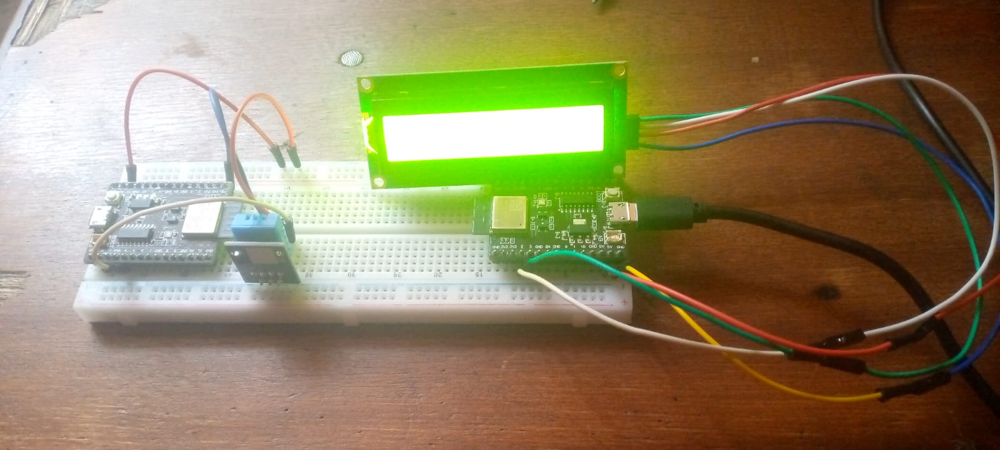
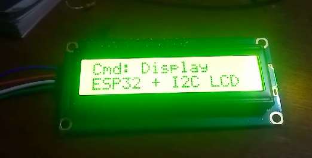

# ESP32 DHT11 Sensor And monitoring with a LCD Display




## Overview
This project involves using an ESP32 microcontroller to read temperature and humidity data from a DHT11 sensor. The data is sent to a specified server endpoint, and commands can be received to display messages on an I2C LCD.

## Hardware Requirements
- **ESP32 Development Board**
- **DHT11 Temperature and Humidity Sensor**
- **I2C LCD Display (16x2)**
- **Breadboard and Jumper Wires**
- **Power Supply (USB cable)**

## Software Requirements
- **PlatformIO**: For writing and uploading code to the ESP32.
- **Flask**: For running the server scripts.

## Setup Instructions

### 1. Hardware Setup
1. **Connect the DHT11 Sensor**:
   - **VCC** to **3.3V** on the ESP32.
   - **GND** to **GND** on the ESP32.
   - **DATA** to **GPIO 4** on the ESP32.

2. **Connect the I2C LCD**:
   - **SDA** to **GPIO 2** on the ESP32.
   - **SCL** to **GPIO 3** on the ESP32.
   - **VCC** to **3.3V** on the ESP32.
   - **GND** to **GND** on the ESP32.

### 2. Software Setup

#### 2.1 ESP32 Code
1. **Clone the Repository**:
   Clone this repository to your local machine.

   ```bash
   git clone https://github.com/tashakid/your-repo-name.git
   cd your-repo-name
   ```

2. **Install Required Libraries**:
   Ensure the following libraries are included in your `platformio.ini`:

   ```ini
   lib_deps = 
       adafruit/DHT sensor library
       adafruit/Adafruit Unified Sensor
       bblanchon/ArduinoJson @ ^6.21.3
       marcoschwartz/LiquidCrystal_I2C@^1.1.4
   ```

3. **Configure WiFi and API Endpoint**:
   Create a `config.h` file in the `src` directory with the following content:

   ```cpp
   #define WIFI_SSID "Your_SSID"
   #define WIFI_PASSWORD "Your_Password"
   #define API_ENDPOINT "http://10.192.12.29:8000/"
   ```

4. **Build and Upload the Code**:
   Use PlatformIO to build and upload the code to your ESP32:

   ```bash
   pio run
   pio run --target upload
   ```

5. **Open Serial Monitor**:
   After uploading, open the serial monitor to view the output:

   ```bash
   pio device monitor
   ```

#### 2.2 Server Setup
1. **Install Flask**:
   Make sure you have Flask installed in your Python environment:

   ```bash
   pip install Flask
   ```

2. **Run the Server Script**:
   Place the `server_send.py` file in your Lightning Studio IDE environment. Run the script:

   ```bash
   python server_send.py
   ```

   This will start the server and listen for incoming requests.

### 3. Testing
- Ensure the ESP32 is connected to WiFi and is publishing data.
- Check the serial monitor for any errors.

## Conclusion
This project allows you to monitor temperature and humidity data from a DHT11 sensor and display messages on an I2C LCD. The integration with a Flask server provides a way to send commands to the ESP32.
